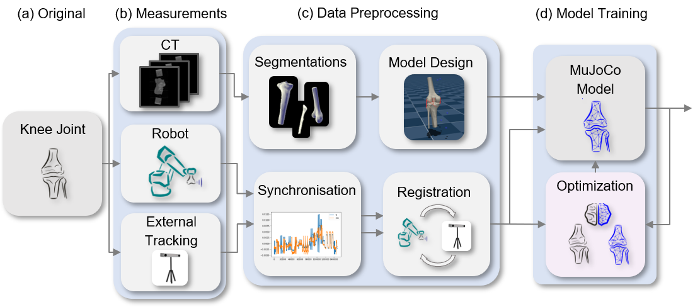
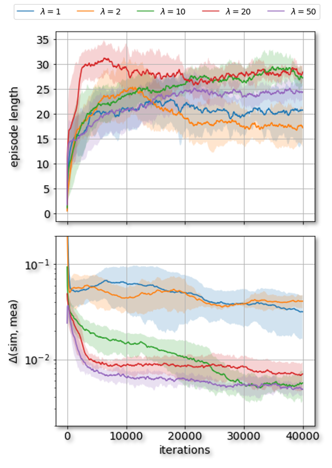

# Reinforcement Learning-Based System Identification for the Human Knee Using Adaptive Models in Robotic Data Acquisition

This repository contains the research, implementation measurement results and evaluation files for an innovative reinforcement leraning algorithm to apply system identification in the human knee.

## Abstract

This research presents a new method using reinforcement learning to improve the biomechanical modeling of the knee joint. It uses proximal policy optimization, a type of model-free optimization, to make simulations more closely match real-world knee movements. By incorporating data from cadaver studies and CT scans, a dynamic model of the knee joint is developed using MuJoCo software. This model allows for optimization of certain parameters based on data from robotic and tracking systems. The approach is tested through simulations and real-world data, showing it can enhance model accuracy and adapt parameters effectively. The study highlights the potential of reinforcement learning in biomechanics, despite challenges like model simplifications and the complexity of knee biomechanics.

## How to Use

- Install the "requirements.txt"
- Modify the respective config file as desired for your train run.
- Run "python src/main.py"

## Results 

## Key Figures

<table>
  <tr>
    <td>
      
       
      <em>Figure 1: Overview of the model development.</em>
    </td>
    <td>
      
       
      <em>Figure 2: Illustration of the training results.</em>
    </td>
  </tr>
</table>

## Key Insights

- Demonstrated the effectiveness of a reinforcement learning-based optimizer for system identification in simulated and real-world scenarios.
- Highlighted the optimizer's ability to significantly reduce episode and value network losses, showcasing its predictive accuracy.
- Emphasized the importance of precisely adjusting the hyperparameter \( \lambda \) to ensure optimal performance.

## Challenges

This study navigated several challenges in advancing system identification techniques:

- Encountered limitations in simulation models that may not fully capture real-world knee biomechanics complexities, particularly due to simplified ligament and tendon properties.
- Noted potential discrepancies in cadaveric knee experiments influenced by dissection constraints and the representation of nonlinear elements as linear springs, possibly skewing optimized trajectories.
- Focused on optimizing a select set of physical parameters, which, while effective, may restrict the model's wider applicability.

## Concluding Remarks

This research highlights the potential of reinforcement learning, especially proximal policy optimization, in enhancing biomechanical models for system identification. By leveraging sophisticated algorithmic approaches alongside empirical data from a dynamic knee model, the study contributes valuable insights into the optimizer's capabilities and limitations. Despite facing challenges in parameter specificity and complex biomechanical system representation, the findings lay a foundation for future improvements in simulation accuracy and broader application. Future directions will aim at improving the model generation process and expanding the optimizer's utility across various applications.

## References

Please consult the accompanying academic paper for a comprehensive list of references.

