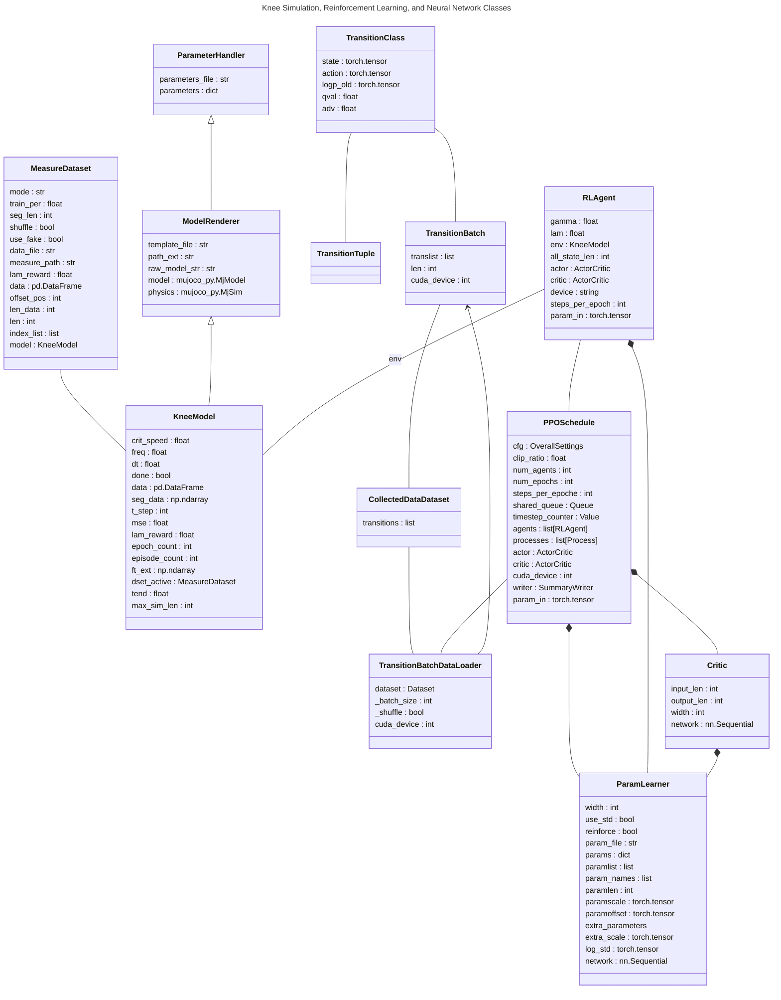

# Knee Model (MJCF)

## Overview

This package contains a simplified robot description (MJCF) of the human knee model. 

  

## Class Structure

## License

This model is released under an [MIT License](LICENSE).